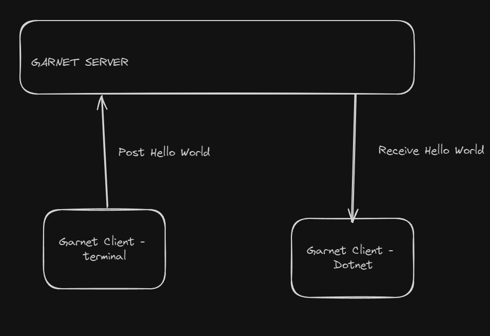

# Using garnet for simple redis implementation




## Garnet server

To initialize the server we will use `docker``, check the `docker-compose.yml` file to set the values e.g. the ports

`docker compose up -d`


## Garnet client

Install on your host a redis client in ubuntu is

```
sudo apt-get install redis-tools
```

To access to the default garnet service use

```redis-cli```

You will see the following prompt
```
127.0.0.1:6379>_
```

To set a new message in the server use the following  command to set a value 

```bash
PUBLISH messages "Hello from queue"
```


## Garnet client


The  client need to use the dotnet program, the library `StackExchange.Redis`


To run the program

```dotnet run ```

Output

```bash
StackExchange.Redis^Cdrec@DESKTOP-8HDHL2R:~/code/docker/garnet-test/Testing Garnet...!!!!
Waiting for messages...
Hello from queue
```

To stop the program use `Ctrl + C`

Notes

https://stackexchange.github.io/StackExchange.Redis/Basics.html